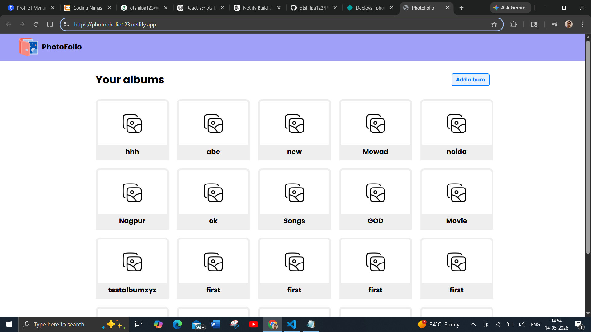
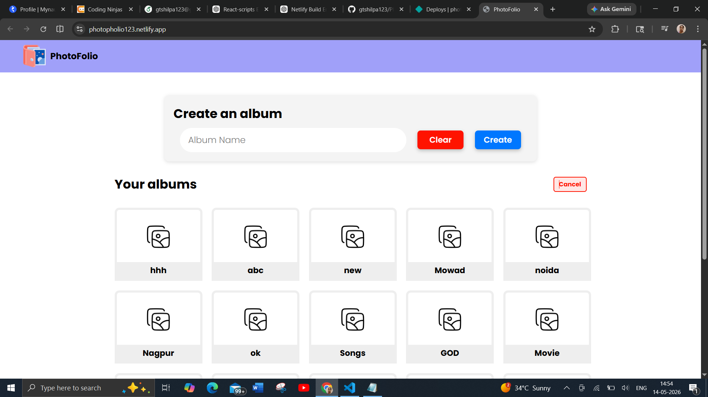
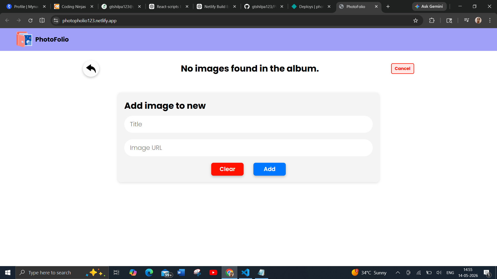

# 📸 PhotoFolio

PhotoFolio is a React-based photo album application that allows users to create albums, upload images, search photos, and manage their photo collections with a clean and responsive user interface.

---

## 🚀 Features

- 📂 Create and manage photo albums
- 🖼️ Add, update, and delete images
- 🔍 Search images within albums
- 🎠 Image carousel preview
- 🔥 Firebase Firestore integration
- ⚡ Real-time UI updates
- 📱 Responsive design
- 🔔 Toast notifications
- 🧪 Unit and integration testing using Jest & React Testing Library

---

## 🛠️ Tech Stack

### Frontend

- React.js
- JavaScript (ES6)
- CSS Modules

### Backend / Database

- Firebase Firestore

### Libraries Used

- React Toastify
- React Spinner Material
- Firebase
- React Testing Library
- Jest

---

## 📂 Folder Structure

```bash
src/
│
├── components/
│   ├── albumForm/
│   ├── albumsList/
│   ├── carousel/
│   ├── imageForm/
│   ├── imagesList/
│   └── navbar/
│
├── static/
│
├── firebase.js
├── App.js
├── index.js
└── ...
```

---

## ⚙️ Installation & Setup

### 1️⃣ Clone the repository

```bash
git clone https://github.com/gtshilpa123/PhotoPholio.git
```

---

### 2️⃣ Navigate to the project folder

```bash
cd PhotoPholio
```

---

### 3️⃣ Install dependencies

```bash
npm install
```

---

### 4️⃣ Start the development server

```bash
npm start
```

The application will run at:

```bash
http://localhost:3000
```

---

## 🔥 Firebase Setup

1. Create a Firebase project
2. Enable Firestore Database
3. Replace Firebase configuration inside:

```bash
src/firebase.js
```

Example:

```javascript
const firebaseConfig = {
  apiKey: "YOUR_API_KEY",
  authDomain: "YOUR_AUTH_DOMAIN",
  projectId: "YOUR_PROJECT_ID",
  storageBucket: "YOUR_STORAGE_BUCKET",
  messagingSenderId: "YOUR_SENDER_ID",
  appId: "YOUR_APP_ID",
};
```

---

## 🌐 Deployment

This project can be deployed on Netlify.

```bash
https://photopholio123.netlify.app/
```

---

## 📸 Screenshots

## Home Page



## Albums Section



## Add image to album



---

## 🤝 Contributing

Contributions are welcome.

1. Fork the repository
2. Create a feature branch
3. Commit your changes
4. Push to your branch
5. Open a Pull Request
